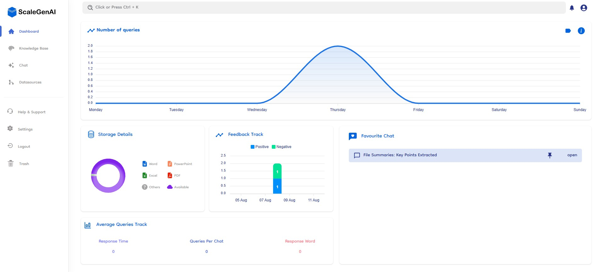

# Analytics Dashboard

The Analytics of Document-Copilot provides comprehensive insights into your document and chat usage. It is divided into four sections to help you track performance, manage storage, and optimize your interactions.

## 📈 Number of Queries

### Weekly Analytics Graph

- **Visual Insights**: A dynamic graph displaying the number of queries made each week.
- **Trend Analysis**: Easily identify trends and patterns in query volume over time.
- **Performance Tracking**: Monitor the efficiency and usage of your documents through query analysis.

## ⭐ Favourite Chat

### Top Engaged Chats(Pinned Chats)

- **Highlight Key Discussions**: Identify and prioritize your most engaged and valuable chats.
- **Important Chat**: Pinned important chat will be tracked from here.
- **Optimize Interaction**: Use insights to enhance communication and collaboration within your team.

## 📊 Storage Detail

### Detailed Breakdown

- **Usage Overview**: Get a clear overview of your storage usage with a detailed breakdown.
- **Category Insights**: See how much storage is taken up by different file types (PDF, Excel, Docs, Others).
- **Percentage Breakdown**: Visual representation of storage distribution by percentage.

**Storage Details:**

- Available: XX%
- PDF: XX%
- Excel: XX%
- Docs: XX%
- Others: XX%

## 💹 Chat Feedback Track

### Key features

- **Visual Feedback Overview**: Displays a bar chart showing the number of positive and negative ratings users give to AI responses.
- **Weekly Analysis**: Graphs feedback counts by date to track user sentiment over a week.
- **Interactive Elements**: Allows users to filter and view feedback data, all positive or negative response data.
- **Real-Time Updates**: Dashboard updates in real-time or at regular intervals to reflect the latest feedback data.

## 📉 Average Track

### Key Performance Metrics

- **Response Time**: Monitor the average response time to queries, ensuring quick and efficient communication.
- **Queries Per Chat**: Track the average number of queries per chat to understand engagement levels.
- **Response Word Count**: Analyze the average word count per response to gauge the depth of interactions.

**Average Metrics:**

- **Response Time**: XX minutes
- **Queries Per Chat**: XX
- **Response Word Count**: XX words
