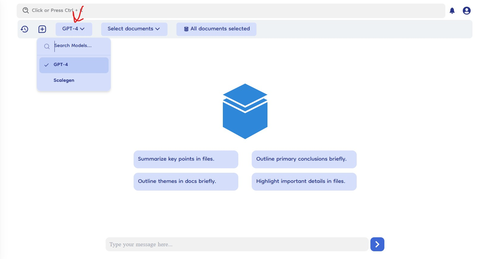

# Switch models

The switch model option in Document-Copilot provides users with the flexibility to choose between different AI models for their chat sessions. This feature is accessible from the top navigation tab and currently offers two model options: GPT-4 and Scalegen Model.

## How It Works

### Location

- **Top Navigation Tab**: The switch model dropdown is located in the top navigation bar, making it easily accessible during any chat session.

### Model Options

- **GPT-4**: This is the default model used for chat sessions. Known for its advanced language processing capabilities, GPT-4 provides highly accurate and context-aware responses.
- **Scalegen Model**: This is the custom model designed specifically for Document-Copilot. Users can switch to this model based on their specific needs and preferences.

### Switching Models

- **Select Model**: To switch models, click on the model dropdown and select the desired model from the options available.
- **Update Chat**: Once selected, the chat will update to use the chosen model for generating responses.
