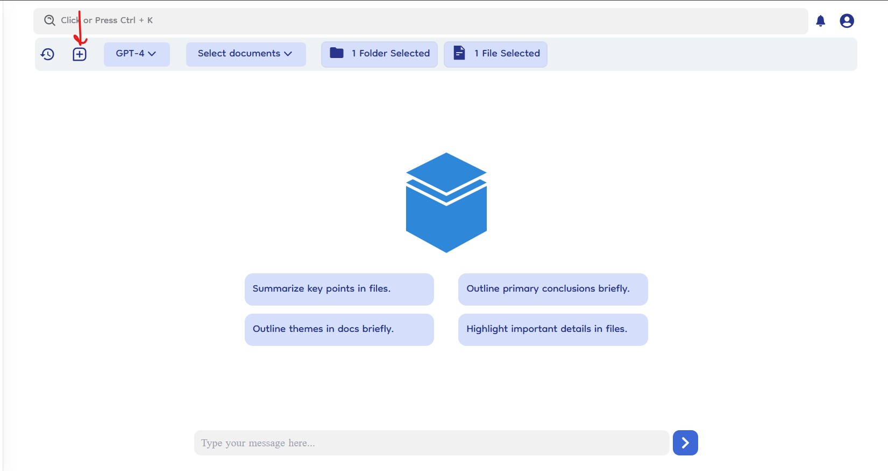
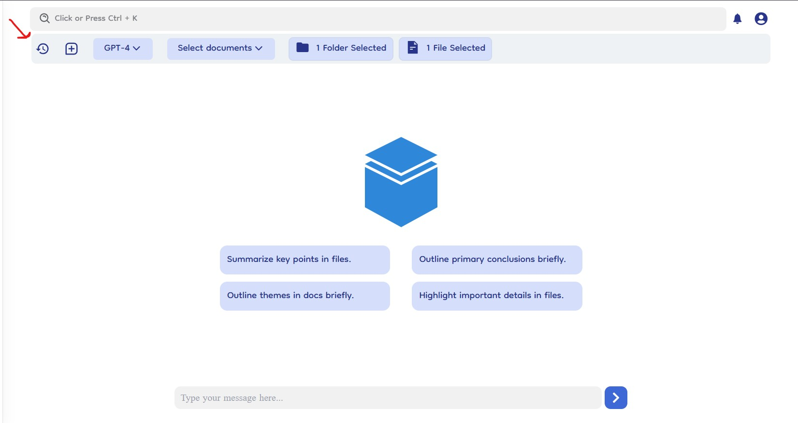
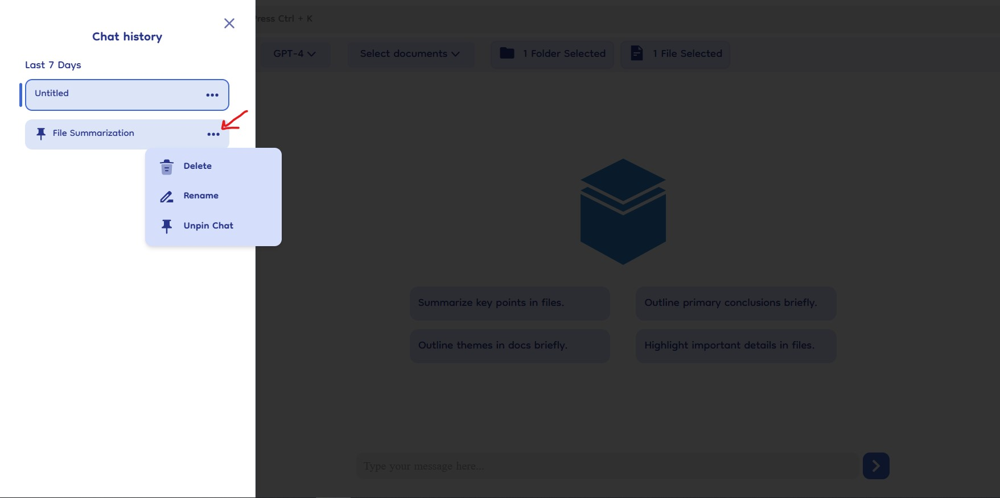

# Chat Management

Document-Copilot’s chat management features provide users with tools to efficiently create, access, and manage their chat sessions. This section covers how to start new chats and manage previous chat histories.

### New Chat Icon

- **Create New Chat**: Click on the new chat icon in the navigation bar to start a fresh conversation. This action opens a blank chat window, allowing you to begin a new query without any previous context.

  

### Chat History

- **History Icon**: Access your previous chat sessions by clicking on the history icon. This icon is located in the top navigation bar.
- **Slider from Left**: Clicking the history icon opens a slider from the left side of the screen, displaying a list of all previous chats.
- **Previous Chats List**: Each chat session in the list has a title and timestamp for easy identification.
  

### Managing Previous Chats

- **Three Horizontal Dots**: Each chat in the history list has three horizontal dots next to it. Clicking these dots opens a dropdown menu with management options.
- **Delete Chat**: Permanently removes the chat from the history.
- **Rename Chat**: Allows you to update the chat title for easier identification.
- **Pin Chat**: Pins the chat to the dashboard's favorite chats section for quick access.
  
