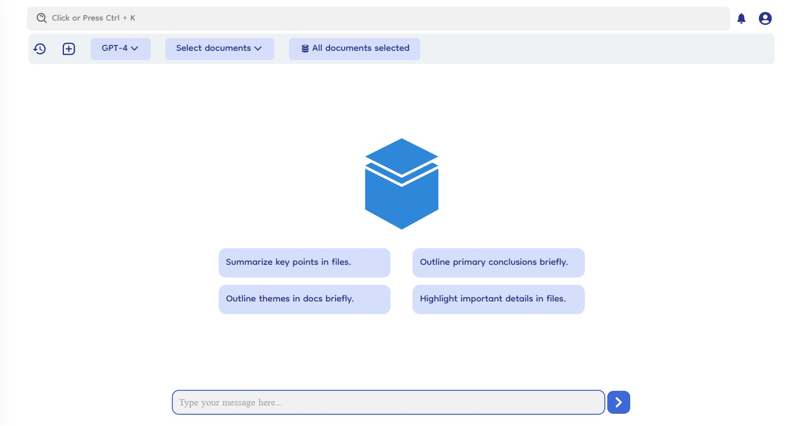

# Overview

The chat feature in Document-Copilot provides a robust and interactive way to engage with your documents. Whether you're starting a new chat, referencing previous conversations, or switching between models, the chat section is designed for ease of use and functionality.

### Pre-Generated Prompts

- **Pre-Generated Prompts**: Upon navigating to the chat tab, users will see a selection of pre-generated prompts. These prompts can help kickstart conversations and provide instant insights.
- **Select and Start**: Simply select a prompt to begin a chat session.

### Document Selection

- **Default Setting**: By default, the chat starts with access to all documents.
- **Select Specific Documents**: Users can refine their chat focus by using the "Select Documents" dropdown to choose specific documents or folders.

### Manage Specific Documents

- **Document Management**: Users can manage the specific documents selected for chat sessions.
- **Modify Selection**: Use the "Select Documents" dropdown or direct select the "X file selected" or "X folder selected" to modify or remove the documents or folders from the chat.
- **Focus Conversations**: Narrow down the scope of the chat to specific documents for more targeted responses.

### Model Selection

- **Default Model**: Chats begin using the GPT-4 language model by default.
- **Switch Models**: Users can switch to a custom model via the "Switch Model" dropdown in the top header bar in chat section.

### Creating New Chats

- **New Chat Icon**: To start a new conversation, click on the new chat icon in the top header tab.
- **Fresh Start**: This opens a blank chat window, ready for new queries and discussions.

### Chat History

- **History Icon**: Access previous chats by clicking on the history icon.
- **Manage Previous Chats**: The chat history feature includes options to delete chats, rename chats, and pin chats.
  - **Delete Chat**: Permanently remove a chat from the history.
  - **Rename Chat**: Update the name of a chat for easier identification.
  - **Pin Chat**: Pin important chats to make them visible on the dashboard's favorite chats section.

### Citations

- **Response Citations**: Each chat response includes chunk citations, indicating the specific document sections used to generate the response.
- **Transparency**: This feature provides transparency and allows users to verify the sources of information.
