# Datasources

Document-Copilot’s datasources feature allows users to import data from external sources directly into the knowledge base. This section covers the process of connecting and syncing data from Google Drive, OneDrive, and SharePoint.

### Available Data Sources

- **Google Drive**
- **OneDrive**
- **SharePoint**

  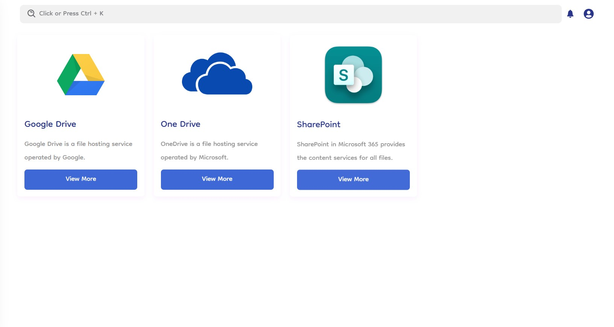

## How It Works

### Creating a Server Mount

1. **Create Server**: To begin, users must create a server mount by providing a name for the server.
2. **Authenticate**: Authenticate to the desired account (Google Drive, OneDrive, or SharePoint) to sync data.

   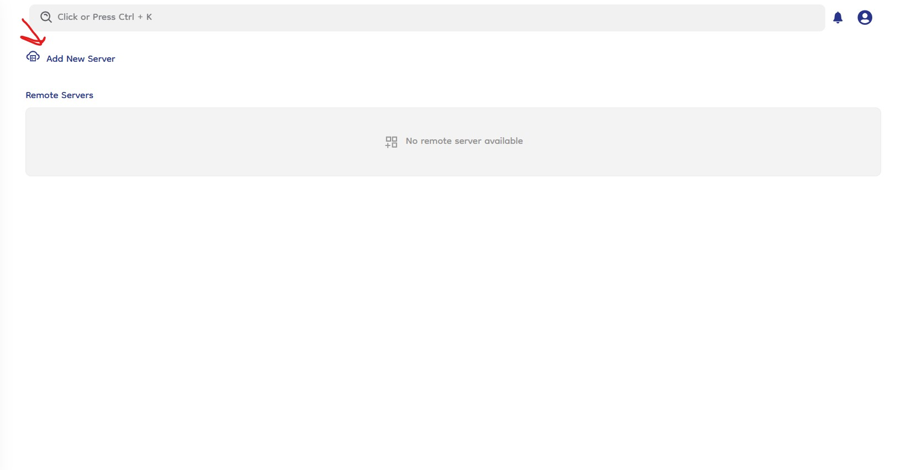

   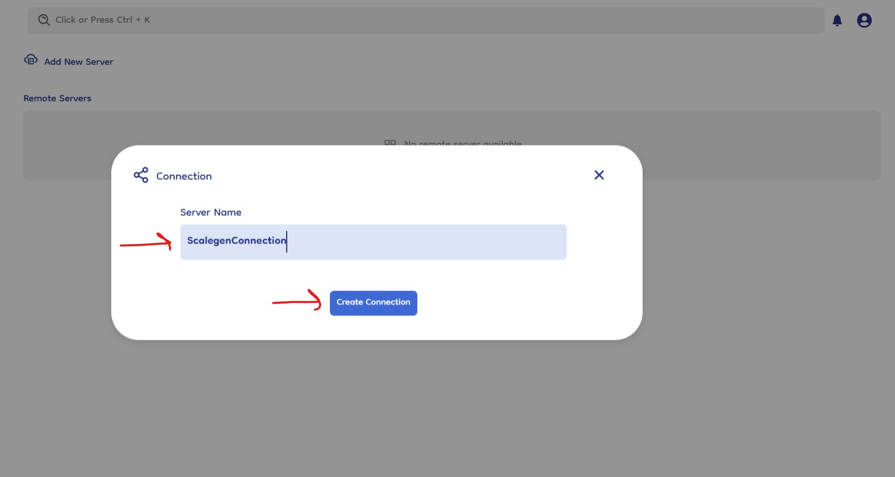

### Making the Connection Active

1. **Select Sync With Server**: Navigate to make the connection active and select the previously created server mount from the dropdown menu.
   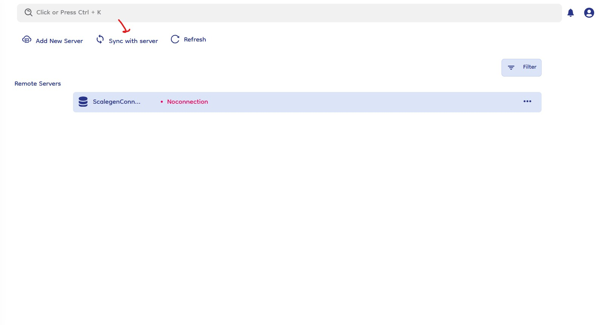

   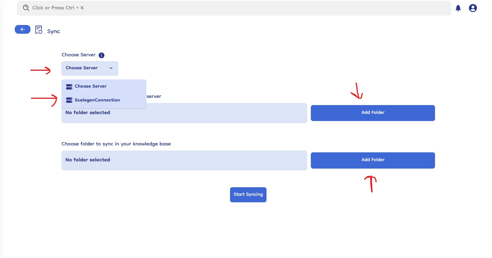

2. **Choose Remote Folder**: Click the "Choose Remote Server Folder" button to open a popup dialog showing a list of folders and files from the remote server. Only folders can be selected (either root or nested folders).
   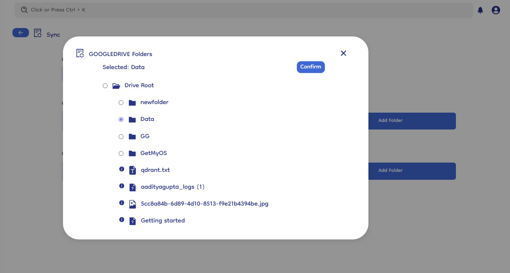

3. **Select Knowledge Base Folder**: Click the "Add Folder" button under the knowledge base section to open a popup with all the knowledge base folders in a hierarchy. Select the desired folder.
   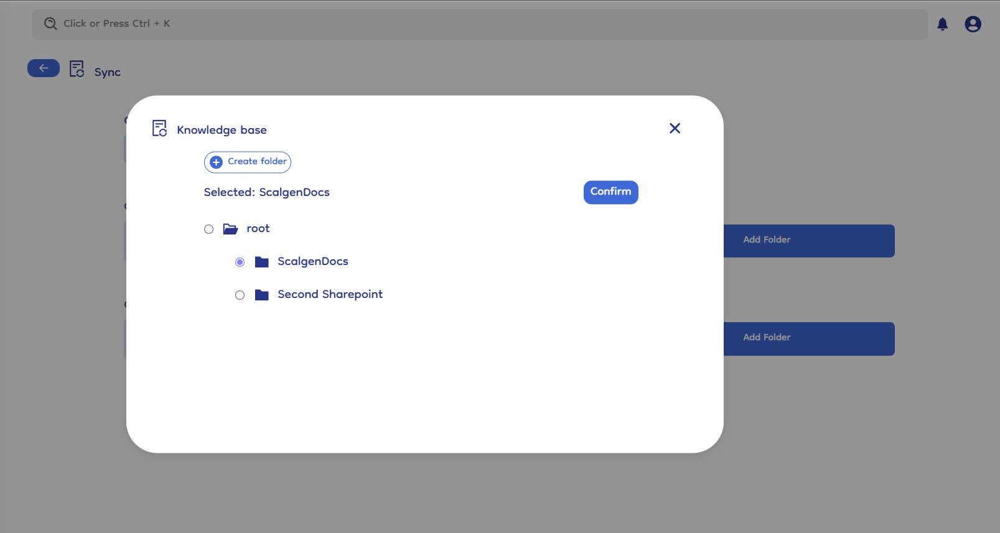

4. **Start Sync**: After selecting the folders, click "Start Sync" to begin the synchronization process. By default, the system will resync the connection every 4 hours, but users can manually start a resync as well.
   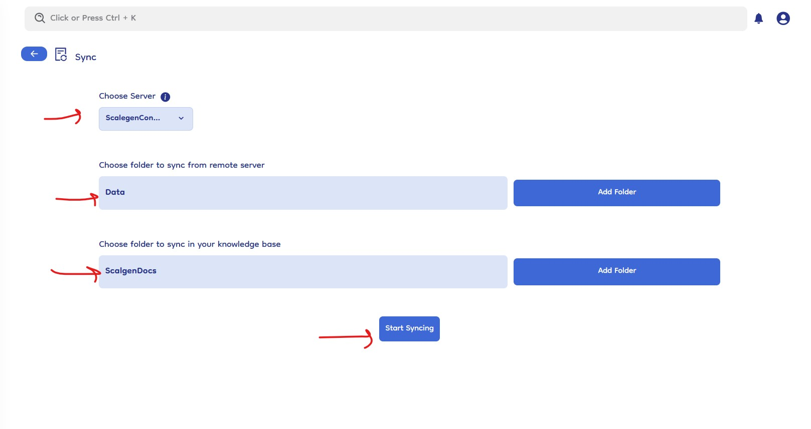

### SharePoint Specifics

- **Choose Site Dropdown**: When using SharePoint, there is an additional step to select a specific site from the "Choose Site" dropdown on server connection page , this option will pop after selecting the server from "Choose Server" dropdown. This allows users to navigate and select the desired different different sites from the SharePoint account.
- **Remote Folder Display**: The folder hierarchy and display for remote folders and files will adjust according to the selected site.
  

### Managing Connections

1. **Server List Page**: After syncing, users are redirected to the home datasource server list page, showing the status of connected servers.
2. **Server Options**:

   - **Delete Server**: Deletes the specific connection (created mount server). Synced files or folders remain in the knowledge base as normal files.
   - **Resync Server**: Syncs changes from the remote server to the connected knowledge base folder.
   - **Complete Resync**: Similar to resync, but it also retrieves files that were moved or deleted from the knowledge base (synced files and folders) and get all that files and folder from remote datasource to the knowledge base again using the connection details.

   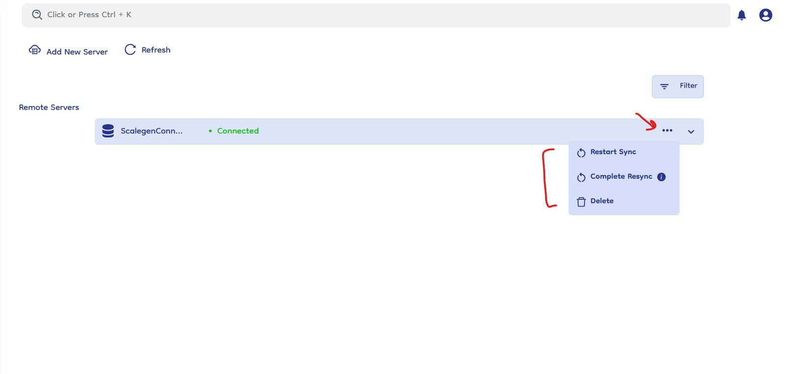

3. **Server Connection Details**: It will also show you the sync details like from which folder the data (remote server folder name) is comming and where it is going (knowledge base folder name).

   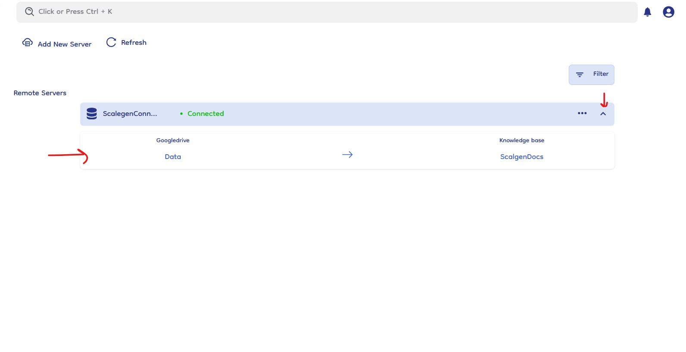

### Knowledgebase Resync Manage and Connection Details

- **Knowledgebase Resync Button On File**: Users can manually resync files from the remote drive to the knowledge base directly from the knowledge base interface. The resync button is available on synced files.
  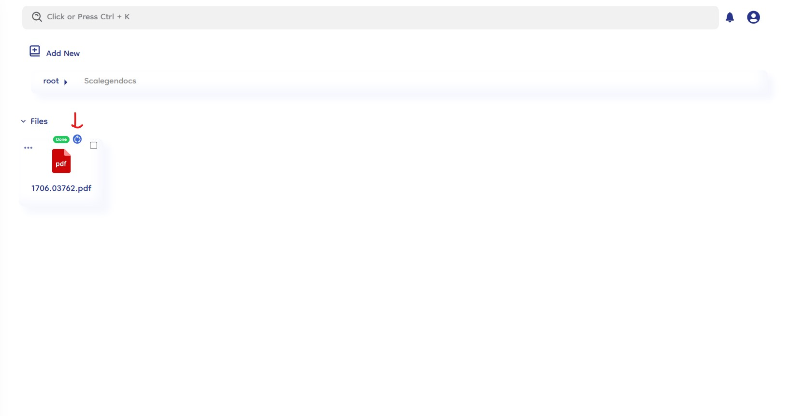

- **View Connection Details**: Click on the three dots on a file to open a right slide bar, displaying all connection details of that file or folder.
  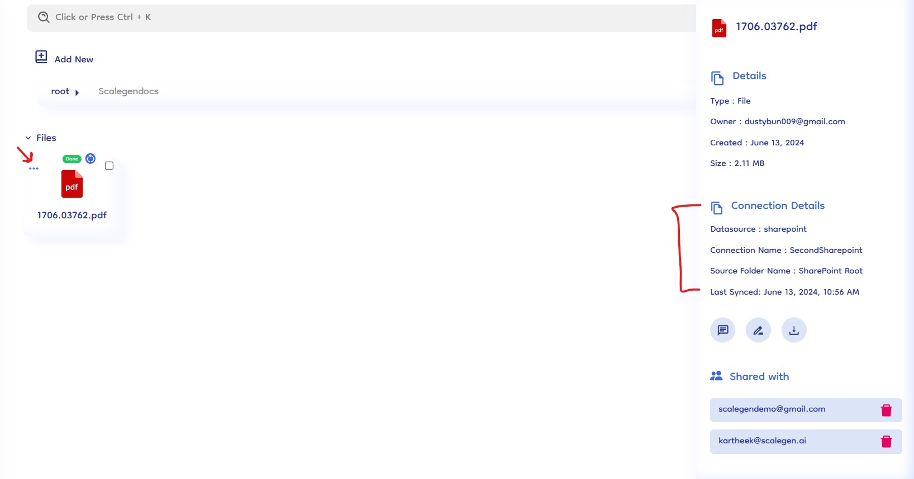
