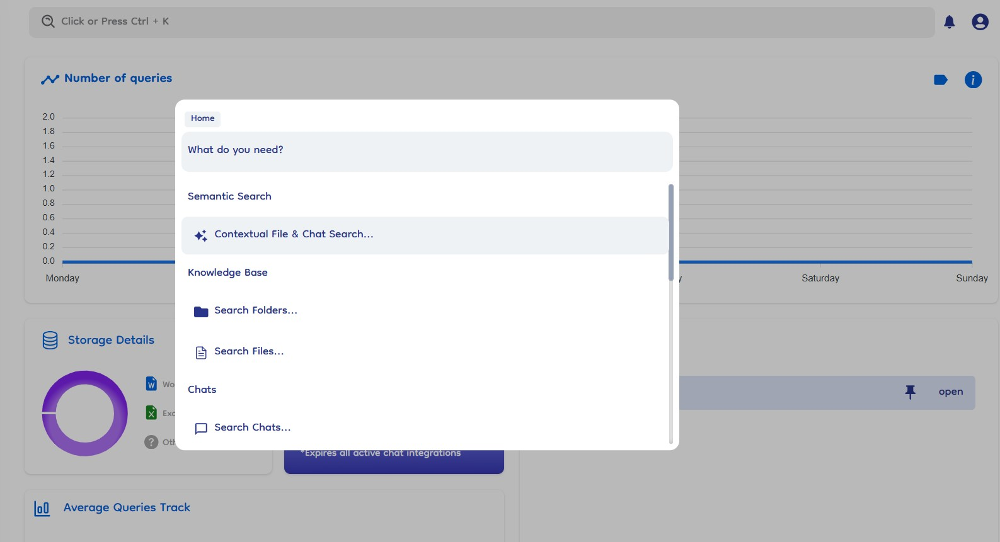

# Overview

The Global Search feature is a powerful feature designed to help users quickly find files, folders, chats, datasources, and navigate through the platform efficiently.
The Global Search bar is located in the top navigation bar. Users can access it by clicking on the search bar or pressing **Ctrl + K**

### Search Options

1. **Contextual Search for Files and Chats**:

   - Enables natural language search for files and chats. Users can type queries in plain language, and the system provides relevant options based on the query.

2. **File Search**:

   - Searches for files based on name string matching.

3. **Folder Search**:

   - Searches for folders based on name string matching.

4. **Chats Search**:

   - Searches for chats based on the name of the chat (string matching).

5. **Datasources (Google Drive, OneDrive, SharePoint)**:
   - Searches for server connections based on the name of the server connection.

### Quick Platform Navigation Commands

- **Route Navigation**: Provides quick commands to navigate to specific sections of the platform such as Knowledge Base, Chats, Dashboard, Trash, Datasources, etc.

> The ability to search and navigate through different sections with quick commands enhances user productivity.

### Usage Global Search

- **Closing the Search Dialog**: By pressing the Esc key or click outside the search dialog box will close it.

- **Navigating Back**: To return to the main search screen (home search) from any search option (like File Search), you have to press the Backspace key when the input box is empty. This action navigates back to the main search where all search options are available.
