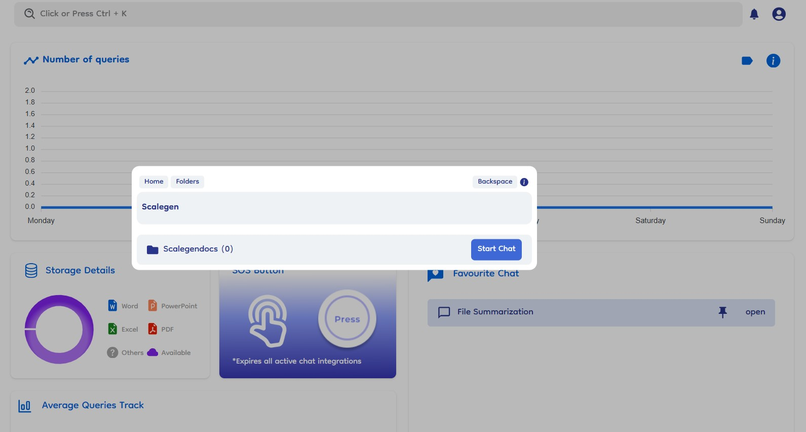

# Static Search

Static Search in global search provides users with a straightforward method to search for specific files, folders, chats, or datasources by directly matching the query with their names. Static search in nothing but the multiple search options that we provide apart from the contextual searching. Options like Search File, Search Folder, Search Chat, Datasources.

> Static Search allows users to quickly find items by typing exact names, enhancing efficiency in information retrieval.

### Key Features

1. **String Matching**:

   - Users input a query that directly matches the name of the file, folder, chat, or datasource they are looking for.
   - The system displays results based on exact name matches, ensuring accuracy in search results.

2. **Flexibility**:
   - Users have the flexibility to choose between Contextual Search (natural language queries) and Static Search (string matching).
   - This allows users to use the method that best suits their search preferences and needs.

### Benefits

- **Precision**: Ensures users find exactly what they are looking for by matching queries directly with item names.
- **User Choice**: Offers users the freedom to switch between search methods based on their preference and search context.
