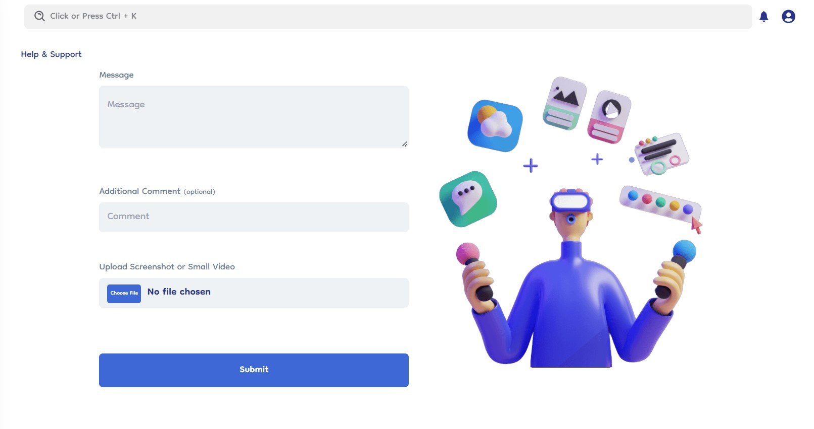

# Help & Support

The Help and Support feature in Document-Copilot provides users with a direct channel to report issues, provide feedback, or seek assistance within the platform.

### Submitting a Query

1. **Message and Additional Comments**: Users have to enter their query or issue description along with any additional comments to provide context in the respective input boxes.
2. **Attach File**: Users have to attach files such as photos or video clips related to the issue for better understanding.

### Ticketing System

- **Ticket ID**: After submitting a query, users receive a unique ticket ID. They should note down this ID for future reference.
- **Response Time**: Administrators aim to respond to queries within 24-48 hours during regular business days.

### Admin Response

- **Resolution**: Administrators review and respond to queries based on priority and severity.
- **Communication**: Users are notified via email or within the platform once their query has been addressed.
