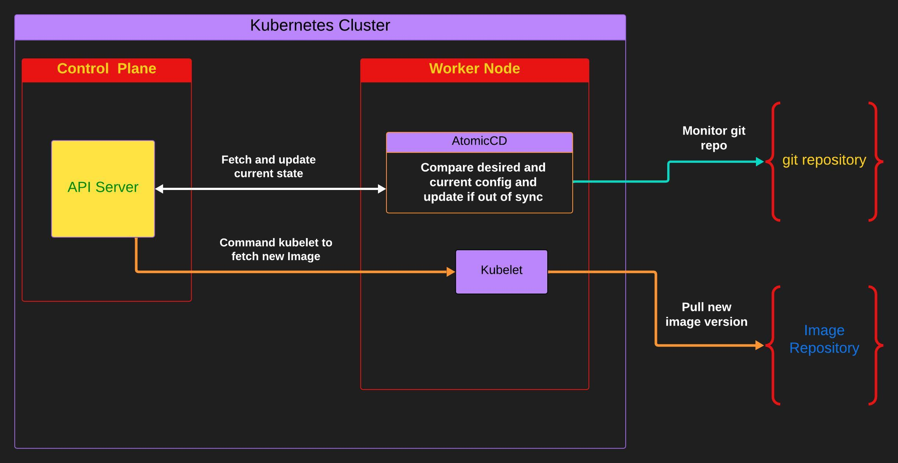

# Overview

### What is AtomicCD?

AtomicCD is a lightweight continuous delivery tool for Kubernetes

### Why atomicCD?

AtomicCD purely focuses on continuous delivery of application's image and image versions rather than monitoring the whole deployment manifest which inturn makes the cd tools to monitor for other K8s resources like configmaps, secrets, PVCs, PVs, etc. AtomicCD does not include a controller for it to work. This approach makes atomicCD lightweight, less resource hungry and simple.

## How does AtomicCD works?
AtmoicCD uses GitOps approach wherein it uses yaml configurations in git repositories as the source of truth. AtomicCD does not monitor yaml manifests or helm charts instead it monitors custom config which is called "Target Config" in AtomicCD.

## Architecture

AtomicCD runs in a pod with a deployment. It doesn't have a controller. The AtomicCD deployement does all the CD work. It compare the Target Config in git repository with the current state of deployed Image and Image version within the K8s cluster and if any of it is found to be out of sync, it updates the new image or image version to the api server.

---

**Incorrect Documentation ? [Raise a GitHub Issue](https://github.com/iam-anshul/AtomicCD/issues)**

For help and support you can reach to me at my socials:

**[GitHub](https://github.com/iam-anshul)
[LinkedIn](https://twitter.com/anshulsingh142)
[Twitter](https://twitter.com/anshulsingh142)**

---