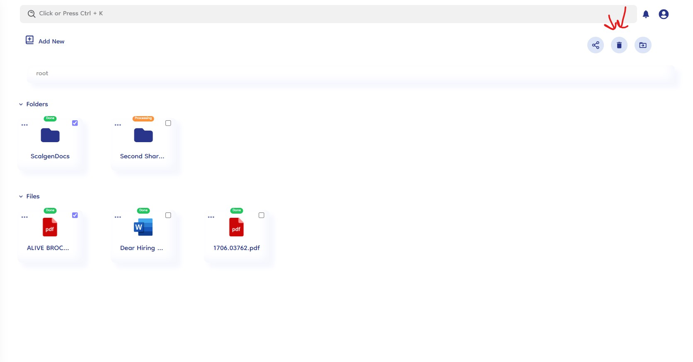
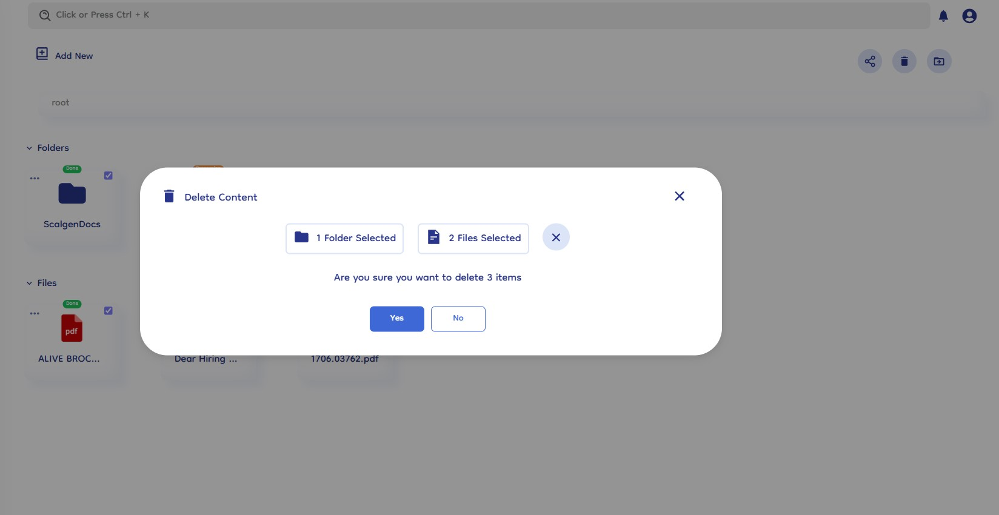

# Delete Documents

Deleting files and folders in Document-Copilot is a straightforward process designed to maintain data integrity and provide flexibility in managing your documents. Follow these steps to delete selected items and manage them effectively.

## How It Works

### 1. Select Files and Folders

- **Choose Items to Delete**: Start by selecting the files and folders you wish to delete from your knowledge base. You can select multiple items by clicking on the checkboxes.

### 2. Click the Delete Icon

- **Locate the Delete Icon**: After selecting the items, find and click on the delete icon. This icon typically represents a trash bin or deletion action.
- **Confirmation Popup**: Clicking the delete icon will prompt a confirmation popup to ensure you intend to delete the selected items.

  

### 3. Confirm Deletion

- **Review Selection**: In the confirmation popup, review the list of items you are about to delete.
- **Click Yes to Delete**: To proceed, click on the "Yes" button within the confirmation popup. This action moves the selected items to the trash.

  

### 4. Manage Deleted Items

- **Access Trash**: Deleted items are not permanently removed immediately. They are moved to the trash, where you can access them for further actions.
- **Restore or Permanently Delete**: From the trash, you have the option to either restore deleted items back to their original location or permanently delete them from Document-Copilot.
