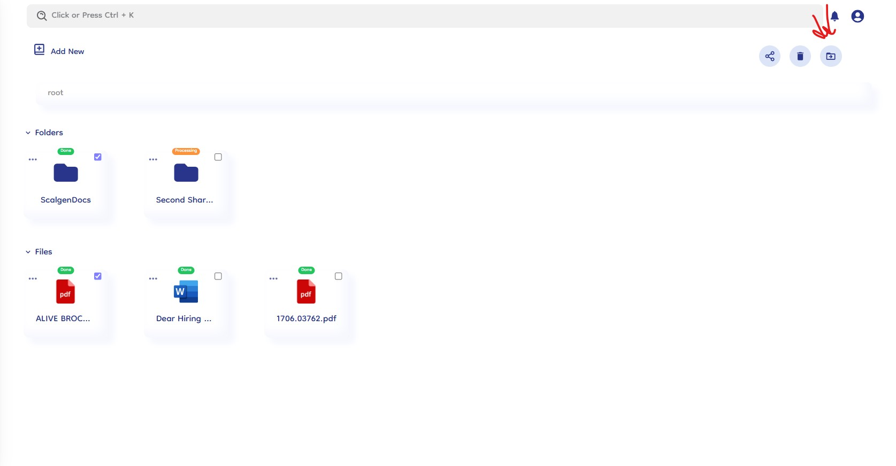
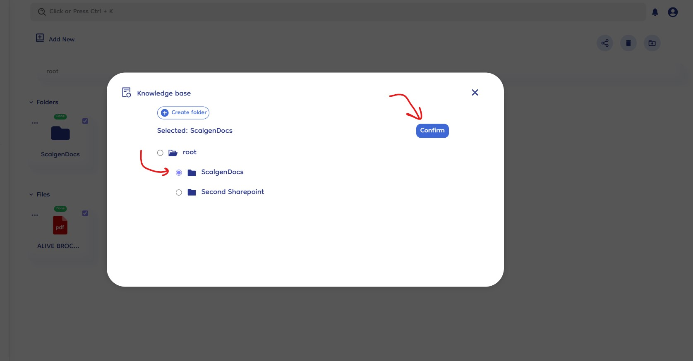
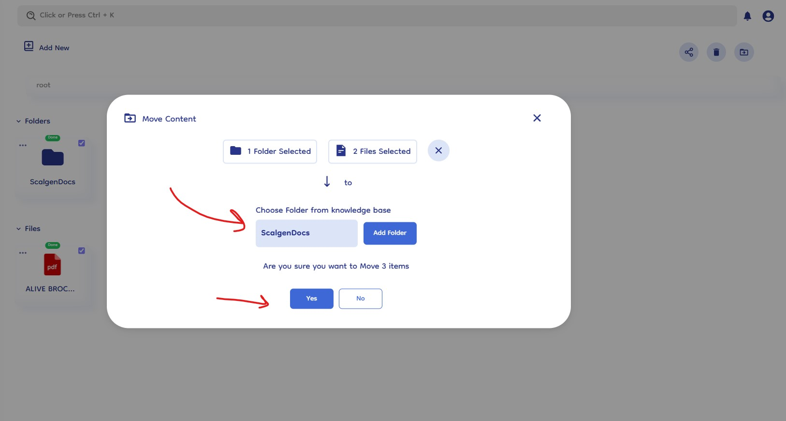

# Move files & folders

Document-Copilot simplifies the process of moving files and folders within your knowledge base, allowing you to reorganize your documents efficiently. Follow these steps to move your selected items to a new location.

## How It Works

### 1. Select Files and Folders

- **Choose Items to Move**: Begin by selecting the files and folders you want to move. Click on the checkboxes of the items to highlight them for selection.
- **Multiple Selections**: You can select multiple files and folders at once for bulk movement.

### 2. Click the Move Icon

- **Locate the Move Icon**: After selecting the items, click on the move icon located in the knowledge base interface. This icon typically represents movement or transfer.
- **Initiate Move Process**: Clicking the move icon will open a popup where you can specify the new location for the selected items.

  

### 3. Select Destination Folder

- **Add Folder**: In the move popup, click on the "Add Folder" button to choose the destination folder where you want to move the selected items.
- **Folder Selection Popup**: A new popup will appear, allowing you to browse and select the desired destination folder.
- **Choose Folder**: Browse through the folder selection popup and click on the folder where you want to move your selected items.
- **Confirm Selection**: After selecting the folder, confirm your choice. The folder selection popup will close, and the destination folder will be set.

  

### 5. Finalize the Move

- **Review Selection**: Ensure that the correct destination folder is displayed in the move popup.
- **Click Yes to Confirm**: Confirm the move by clicking the "Yes" button. This action will move the selected files and folders to the chosen destination.

  
