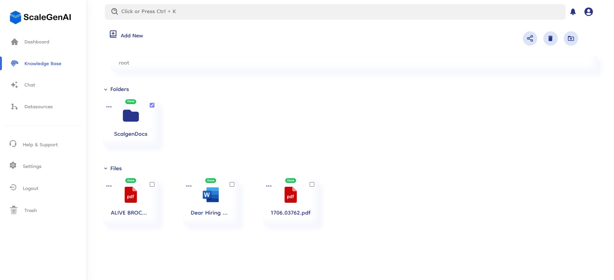

# Overview

The Knowledge Base feature in Document-Copilot is designed to centralize and streamline your information management. It provides a complete file system, allowing you to organize, share, and manage your documents with ease.

## 📁 Complete File System

### Folders and Files

- **Organized Structure**: Create a hierarchical structure with folders and subfolders to organize your files efficiently.
- **Easy Navigation**: Quickly navigate through your documents with a clear and intuitive file system.
- **Scalable Management**: Handle a large number of files and folders without losing track of important documents.

## ⬆️ Upload Files and Folders

### Seamless Uploading

- **File Upload**: Easily upload individual file and multiple files directly into the knowledge base.
- **Folder Upload**: Upload entire folders, maintaining your pre-existing organizational structure.
- **Drag and Drop**: Use the drag-and-drop functionality for quick and convenient uploads.

## 🗂️ Create Folder

### Structured Organization

- **Folder Creation**: Create new folders to organize your documents logically.
- **Subfolder Support**: Nest subfolders within folders to create a detailed hierarchy.
- **Custom Naming**: Name folders and subfolders to reflect their contents accurately.

## 🤝 Team Sharing

### Collaborative Access

- **Shared Access**: Share folders and files with team members to facilitate collaboration.
- **Permission Control**: Manage access permissions to ensure data security and appropriate sharing levels.
- **Real-Time Updates**: Collaborate in real-time with automatic updates to shared documents.

## 🔄 Move Files and Folders

### Flexible Management

- **Reorganize Structure**: Reorganize your file system to reflect changes in your projects or workflows.
- **Batch Actions**: Move multiple files and folders simultaneously for efficient management.

## 🗑️ Delete Folders and Files

### Efficient Clean-Up

- **File Deletion**: Remove outdated or unnecessary files to keep your knowledge base clean.
- **Folder Deletion**: Delete entire folders and their contents to maintain an organized workspace.
- **Permanent Removal**: First the deleted content moved to trash and then you can delete them or recover them from trash as per your need.

## 📊 Individual Details Right Slide Bar

### In-Depth Information

- **File Details**: View comprehensive details about each file, including size, type, and upload date.
- **Folder Insights**: Get insights into folder contents and structure from the right slide bar.
- **Connection Insights**: Get insights of the datasource that the folder or the files has been synced from.
- **Team Sharing**: You can view the details of your file and see with whom it has been shared in your team. Additionally, you can revoke access for any shared team member directly from the right sidebar.
- **Quick Actions**: Access quick actions like downloading file, start chatting, renaming directly from the details bar.

## 📌 Embedding Status of Files and Folders

### Integration and Accessibility

- **Status Tracking**: Monitor the embedding status of each file and folder.
- **Enhanced Integration**: Integrate your knowledge base with other datasources extend functionality.

---
