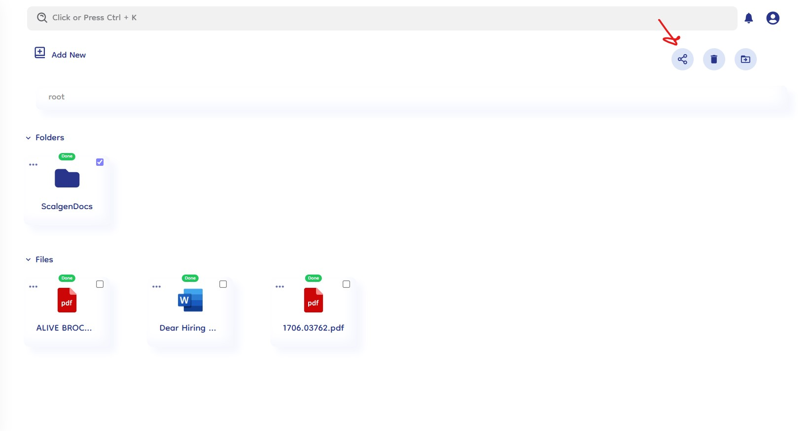
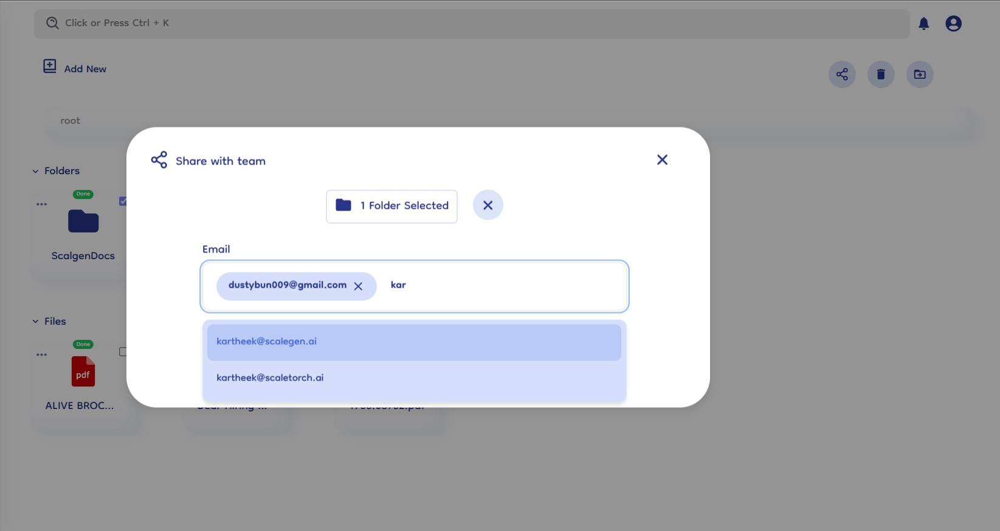
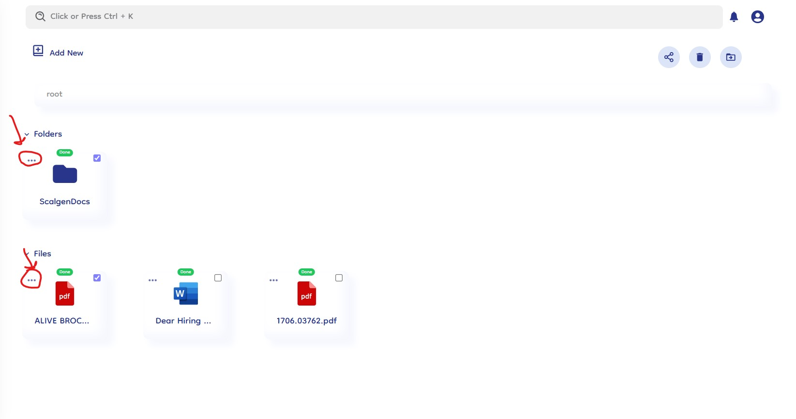
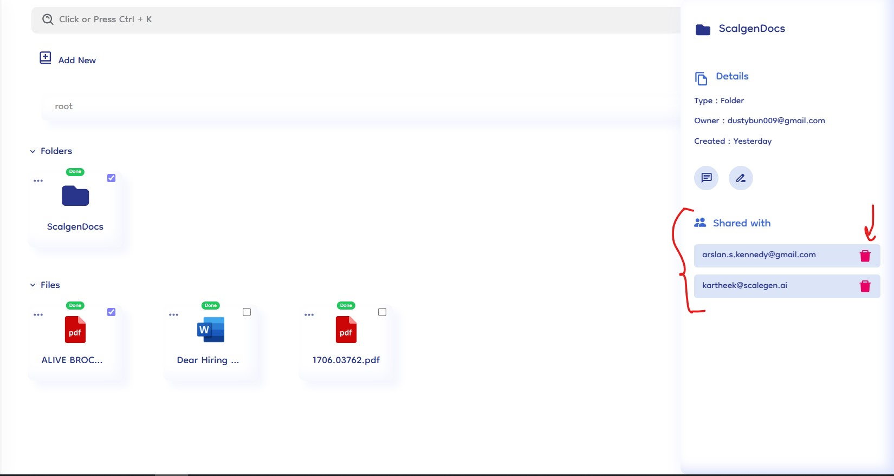

# Team Sharing

Team sharing in Document-Copilot facilitates seamless collaboration by allowing users to share files and folders with your teammates or colleagues. This feature ensures that everyone has access to the necessary documents, enhancing productivity and teamwork. Here’s how it works:

## How It Works

### 1. Select Files and Folders

- **Choose Items to Share**: Begin by selecting the files and folders you want to share. You can select multiple items by clicking on the checkbox on each.
- **Highlight Selection**: The selected items will be highlighted and all the options will be visible, indicating they are ready for sharing.

### 2. Click the Share Icon

- **Locate the Share Icon**: Once you have selected the items to share, click on the share icon. This icon is typically represented by a sharing symbol, as shown in below image.
- **Access Sharing Options**: Clicking the share icon will open the sharing dialog box where you can input the email of your team members.
  

### 3. Enter Email Addresses

- **Start Typing Emails**: In the sharing dialog box, begin typing the email addresses of your teammates or colleagues.
- **Auto-Suggest Feature**: As you type, Document-Copilot will auto-suggest email addresses based on your contacts and previously shared addresses.
- **Select from Results**: Choose the correct email addresses from the auto-suggested results.

  

### 4. Confirm Sharing

- **Review Selection**: Ensure that all intended recipients are listed. You can review the files and folders you've selected for sharing by clicking on the "X folders selected" or "X files selected" box above the input box.
- **Click Share**: Once you have entered all the email addresses and reviewed your selection, click the "Share" button to grant access to the selected items.

### 5. Unshare Files and Folders

- **Access More Options**: To unshare a file or folder, click on the three horizontal dots (more options) icon on the shared files and folders.
- **View Shared Emails**: All shared items will display a list of emails in the right-side panel.
- **Remove Access**: Directly unshare the item by removing the email addresses from the list.

  

  
