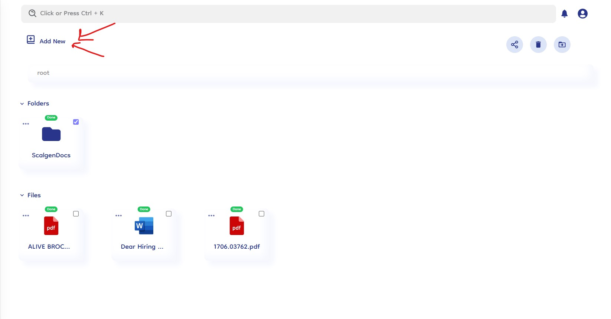
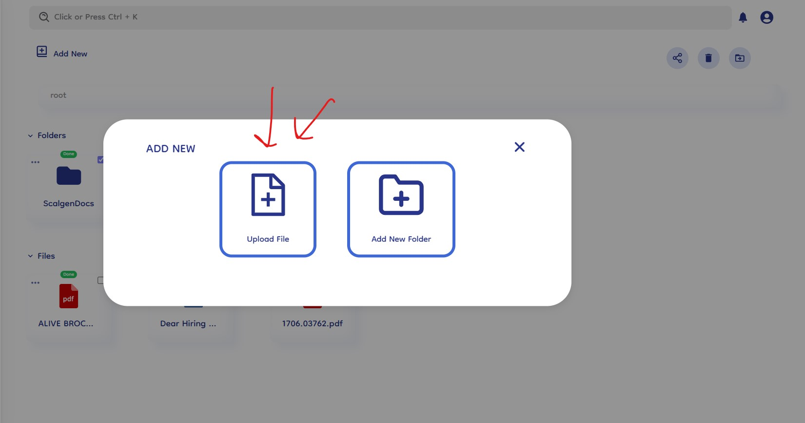
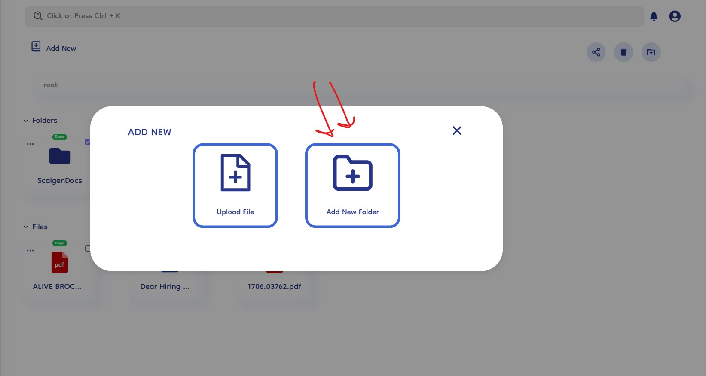
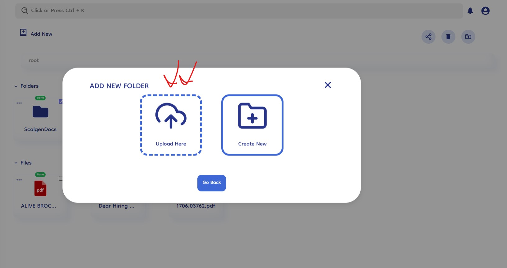
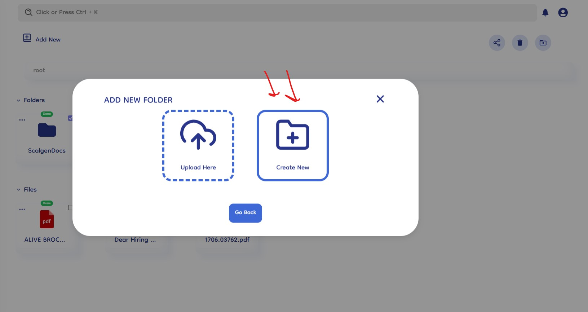
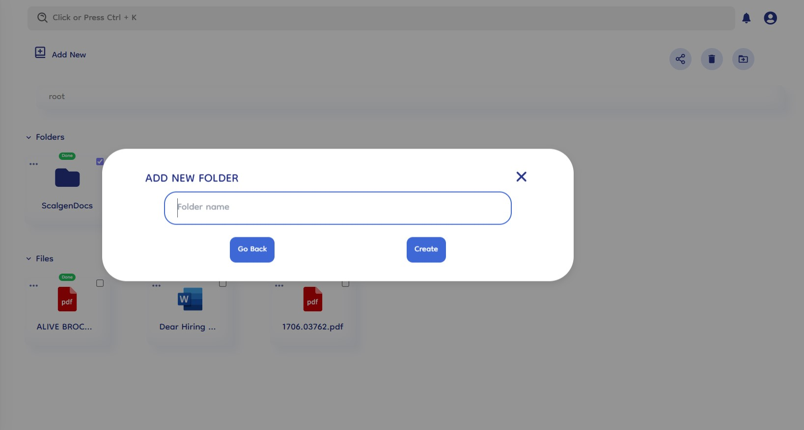

# Upload Documents

Document-Copilot's upload system is designed for simplicity and efficiency, enabling users to quickly add new files and folders to their knowledge base. Here's a step-by-step explanation of how the upload system works.

## How It Works

### 1. Initiate the Upload Process

- **Click "Add New" Button**: Begin by clicking the "Add New" button located in the main interface. This action will present you with options to either upload files, upload folders or create folders.
  

### 2. Upload File

- **Select "Upload File" Option**: After clicking the "Add New" button, choose the "Upload File" option.
- **Choose File**: A file selector dialog will appear, allowing you to browse and select the file you wish to upload.
- **Drag and Drop**: Alternatively, you can drag and drop your file directly into the designated area for a faster upload process.
- **Upload Confirmation**: Once selected, the file will begin uploading, and you will receive a confirmation once the upload is complete.
  

### 3. Add Folder Section

- **Move to Folder Section**: If you need to manage folders, click the option to move to the folder section.
- **"Add New Folder" Options**: In the folder section, you will see two options:
  - **Upload Folder**: Choose this option if you want to upload an entire folder. This maintains the folder's internal structure, including all subfolders and files.
  - **Create Folder**: Select this option to create a new folder from scratch.
    

### 4. Upload Folder

- **Select "Upload Folder"**: Choose the "Upload Folder" option within the folder section.
- **Browse and Select Folder**: A folder selector dialog will appear, allowing you to browse and select the folder you want to upload.
- **Maintain Structure**: The selected folder, along with its internal structure and contents, will be uploaded to the knowledge base.
- **Upload Confirmation**: You will receive a confirmation once the folder upload is complete.
  

### 5. Create Folder

- **Select "Create Folder"**: Choose the "Create Folder" option within the folder section.
- **Name Your Folder**: Provide a name for the new folder to reflect its contents.
- **Folder Creation**: The new folder will be created instantly, ready for you to move files into or organize further.
  

  
