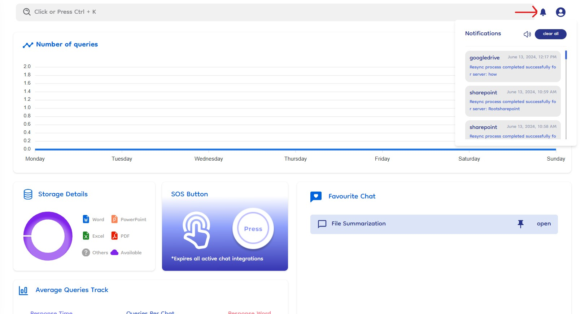
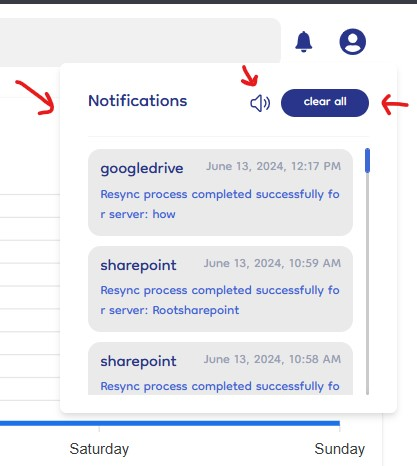

# Notifications

Document-Copilot’s notification system ensures users stay informed about key activities and updates within the platform. This section explains how notifications work, where to find them, and how to manage them. The notification bell icon is located next to the global search bar in the top header.

### Types of Notifications

1. **Connection and Sync Activities**: Notifications are sent when a user creates a connection, starts a sync, or clicks resync or complete resync.
2. **File Shares**: Users receive notifications when someone shares files with them.

### Notification Alerts

- **Sound Notification**: A "Tinggg" sound plays whenever a new notification is received.
- **Popup Notification**: A small notification box appears at the top right of the screen, displaying details about the notification. This popup disappears after 3-4 seconds.

> The 'Tinggg' sound and popup box ensure that notifications are promptly noticed.

### Viewing and Managing Notifications

1. **View All Notifications**: Click on the notification bell icon to see a list of all old notifications.
2. **Clear Notifications**: A button within the notification list allows users to clear all old notifications.
3. **Mute/Unmute Notification Sound**: A button is available to mute or unmute the notification sound as needed.

   
