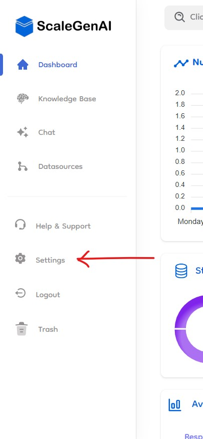
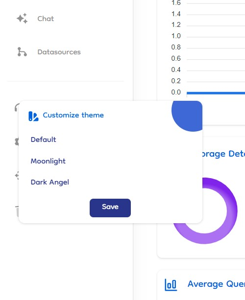

# Theme Settings

We offers customizable themes to enhance user experience. The theme setting option allows users to choose from various themes to suit their preferences. The Settings option is located in the side navigation bar.

### Selecting a Theme

1. **Open Theme Settings**: Click on the "Settings" tab in the side navigation bar to open the theme settings.
2. **Theme Options**: A small box appears, presenting a few theme options:

   - **Default**: The standard theme.
   - **Moonlight**: A cooler, more subdued theme.
   - **Dark Angel**: A darker, high-contrast theme.

### Applying and Saving a Theme

1. **Preview Theme Change**: Users can see the changes in the theme immediately after selecting an option. This allows them to preview the theme before finalizing their choice.
2. **Persisting Changes**: The selected theme will not persist after a page refresh unless the user clicks "Save." Clicking "Save" ensures that the chosen theme is applied consistently across sessions.

   
