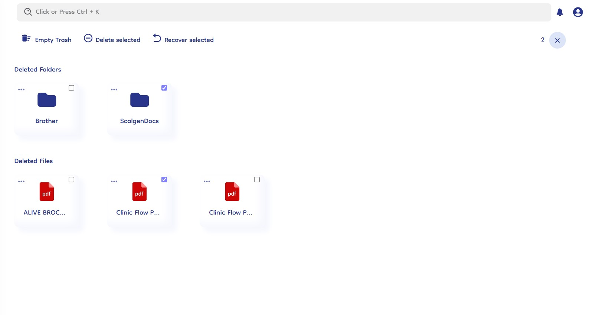

# Trash

The trash management feature in document-copilot ensures that deleted files and folders are temporarily stored in the trash, allowing users to recover or permanently delete them as needed.

### Trash Options

1. **Empty Trash**: Permanently deletes all items currently in the trash. This action cannot be undone.
2. **Delete Selected**: Allows users to delete specific files and folders from the trash. This action is irreversible.
3. **Restore Selected**: Enables users to restore selected files and folders from the trash back to their original locations in the knowledge base.

### Managing Deleted Items

- **Select and Restore**: Users can select individual files or folders from the trash and restore them to their previous locations.
- **Permanent Deletion**: Deleted items remain in the trash until they are either restored or permanently deleted via the "Empty Trash" or "Delete Selected" options.
