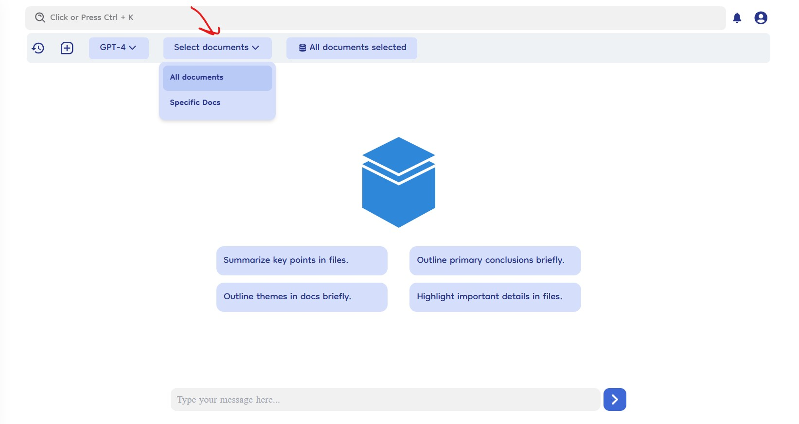
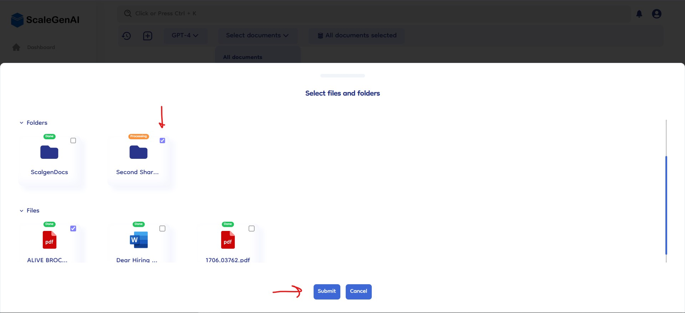
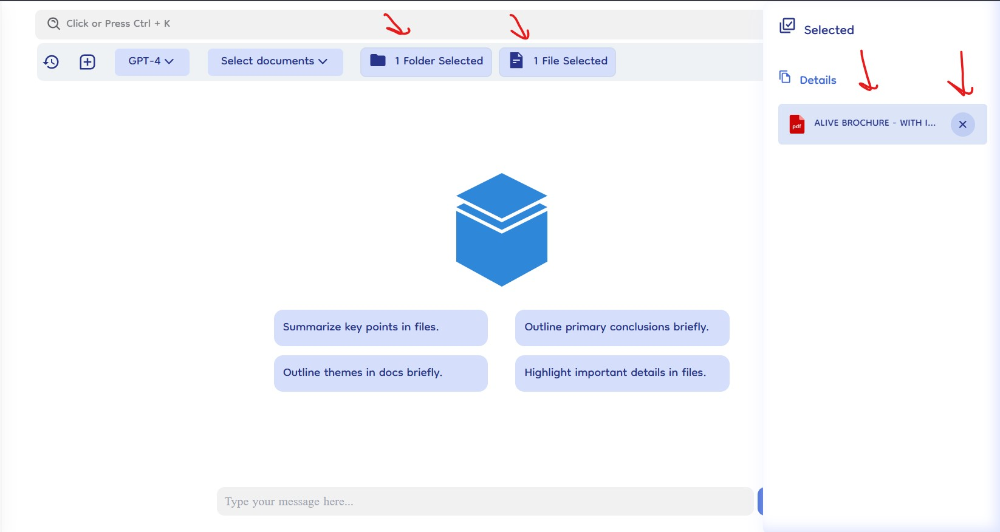

# Select Documents

The select document section in Document-Copilot allows users to customize the scope of their chat sessions by choosing specific documents or folders to focus on. By default, the chat includes all documents, but this can be adjusted through the "Select Document" dropdown in the top navigation bar.

## How It Works

### Default Setting

- **All Documents**: By default, the chat feature works on all documents within the knowledge base, providing comprehensive responses from the entire document collection.

### Switching to Specific Documents

- **Select Document Dropdown**: Located in the top navigation bar, the "Select Document" dropdown allows users to change the scope of their chat.
- **Two Options**:
  - **All Documents**: The default setting, including all documents.
  - **Specific Document**: Select this option to narrow the chat focus to specific documents or folders.

### Selecting Specific Documents

- **Open Selection Slider**: After choosing "Specific Document" from the dropdown, a slider will appear from the bottom of the screen, displaying an interface similar to the knowledge base.
- **Browse and Select**: Users can browse through the document and folder structure, including nested folders, to select the desired documents or folders.
- **Submit or Cancel**: Once the selection is made, click "Submit" to finalize the choice or "Cancel" to close the slider without making changes.
  

### Viewing and Managing Selected Documents

- **Files and Folders Selected**: After selecting specific documents, users will see two additional boxes labeled "X files selected" and "X folders selected."
- **Right Slide Bar**: Clicking on either box opens a right slide bar that lists all selected documents and folders.

  - **Remove Items**: Each listed item has a cross icon for easy removal from the selection.

  
