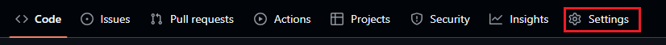
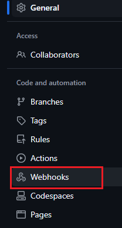
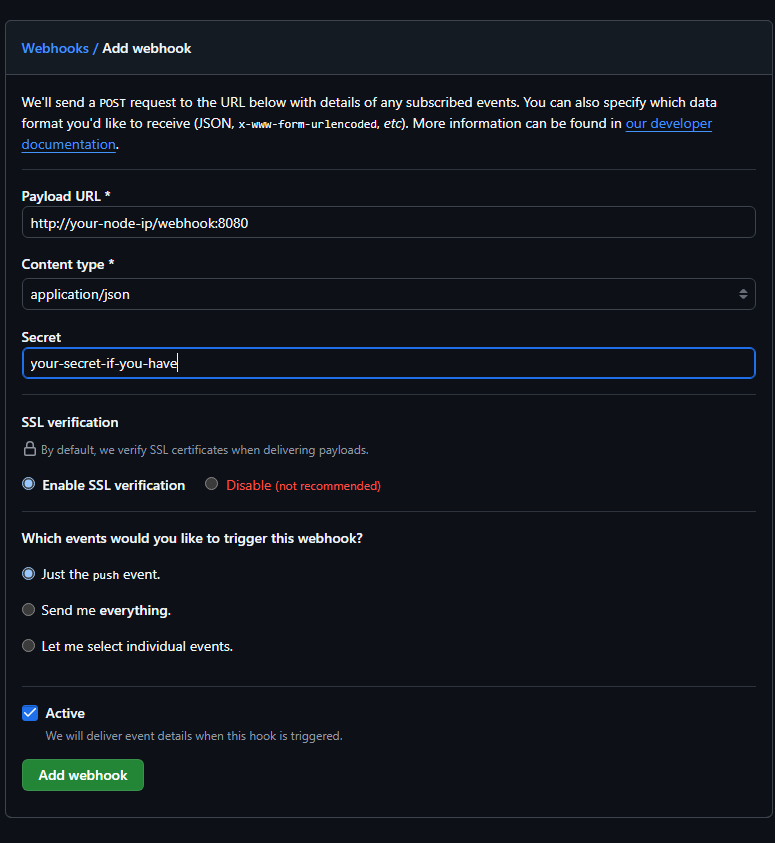

# Webhook

You can set webhook triggers in your git repository so that whenever there is a change in Target Config in github repository, AtomicCD instantly scans for the new Target Config.

This tutorial shows how to set webhooks triggers for AtomicCD in Github Repository.

1. First you need to follow [Deploy AtomicCD On Kubernetes Cluster](deploy.md#below-are-the-steps-to-setup-atomiccd-to-implement-continuous-delivery-for-a-python-application) tutorial upto step **6** if you want webhook triggers without trigger authentication else if you want to set webhook trigger authentication follow upto step 5. Skip the next step (step2) if you are moving without trigger authentication.

2. Create Create a Configmap name with a Track Config file. **Follow step 2a if repository is public and follow 2b if repository is private**.

  - **(2a)** Make a file named `configmap.yaml`. Below in the track config configmap, replace 
    "your github repository url" with your actual repository URL. Change **your secret webhook** with the secret you want to authenticate webhook trigger with. Copy the final contents in your `configmap.yaml` file. Make sure the branch is `main`.

    ```yaml
    apiVersion: v1
    kind: ConfigMap
    metadata:
        name: atomic-cd-cm
    data:
        trackConfig.yaml: |
            trackConfig:
              repoURL: your github repository url
              path: /targetConfig.yaml
              webhookSecret: your secret webhook
    ```

    - **(2b)** Make a file named `configmap.yaml`. Below in the track config configmap, 
      replace "your github repository url" with your actual repository URL. Change **your github personal access token** with the personal access token for your github private repository. Change **your secret webhook** with the secret you want to authenticate webhook trigger with. Copy the final contents in your `configmap.yaml` file. Make sure the branch is `main`.

      ```yaml
      apiVersion: v1
      kind: ConfigMap
      metadata:
          name: atomic-cd-cm
      data:
          trackConfig.yaml: |
              trackConfig:
                repoURL: your github repository url
                path: /targetConfig.yaml
                token: your github personal access token
                webhookSecret: your secret webhook
      ```

    - Apply the file with `kubectl apply -f configmap.yaml` command.

5. Make a **NodePort** type service for AtomicCD
    - Make a file named `svc.yaml` and copy the contents of below svc file in it:

      ```yaml
      apiVersion: v1
      kind: Service
      metadata:
        name: atomiccd-svc
      spec:
        type: NodePort
        selector:
          app: atomic-cd
        ports:
        - port: 8080
          targetPort: 8080
      ```

    - Apply the file with `kubectl apply -f svc.yaml` command.

6. Follow [Deploy AtomicCD On Kubernetes Cluster](deploy.md#below-are-the-steps-to-setup-atomiccd-to-implement-continuous-delivery-for-a-python-application) tutorial step **7**

7. Go to your Github repository settings: 


8. Go to webhooks settings on the webhook page and then click on `Add webhook`:
  
    


9. Get node ip of your node.
    - Run command `kubectl get pods` and copy the pod name of your AtomicCD pod, pod will have the prefix `atomic-cd`.
    - Run command `kubectl describe pod pod-name | grep Node:` **(change "pod-name" with the name of pod copied in above step)**.
    - In the result of above command copy the node name value until before `/`. For example `ip-172-31-12-101.ap-south-1.compute.internal`
    - Now run the command `kubectl describe node your-node-name | grep ExternalIP:` **(change "your-node-name" with the name of node copied in above step)**.
    - Copy the public IP in the result of above command. This is your Node ip where AtomicCD pod is running.

10. Put your **node ip** which you get from above step in place of **your-node-ip** in the url: `http://your-node-ip/webhook:8080`. Click on Add webhook in Github and then in the **Payload URL** section, pathe the url.

11. Select the content type as `application/json`.

12. If you followed step 2, paste the value of `webhookSecret` field you provided in Track Config in the `Secret` field otherwise leave this field.

13. select `Enable SSL verfication`

14. Select `Just the push event.` in `Which events would you like to trigger this webhook?` section. 

15. Webhook config should look like the below picture.
  

16. Click on Add webhook.


### Trigger Webbhook

- Monitor logs of AtomicCD with command: `kubectl logs pod-name` (change "pod-name" with the name of AtomicCD pod).

- Change `containerTag` field in your Target Config in github repository from `3.9` to `3.10`.

- You will instantly see `recieved webhook request`, `Authenticating webhook...`(if trigger authentication setup), `Webhook authentication successful!`(if trigger authentication setup) and `Recieved webhook trigger. Syncing` in AtomicCD container log. This means AtomicCD has recieved webhook trigger and scanning for the new Target Config in the git repository.

---

For help and support you can reach to me at my socials:

**[GitHub](https://github.com/iam-anshul)
[LinkedIn](https://twitter.com/anshulsingh142)
[Twitter](https://twitter.com/anshulsingh142)**

---